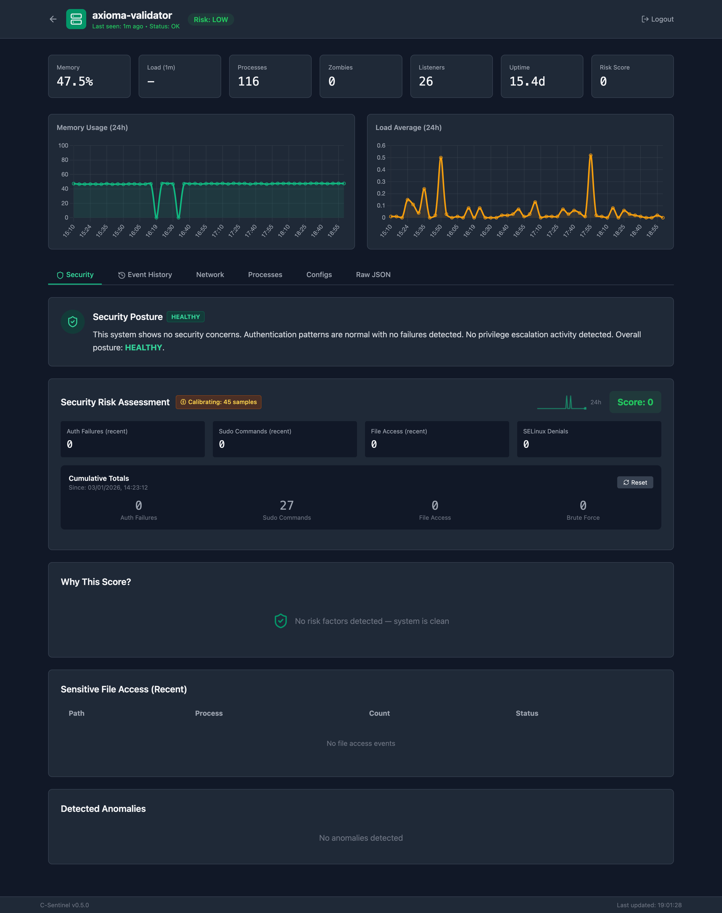
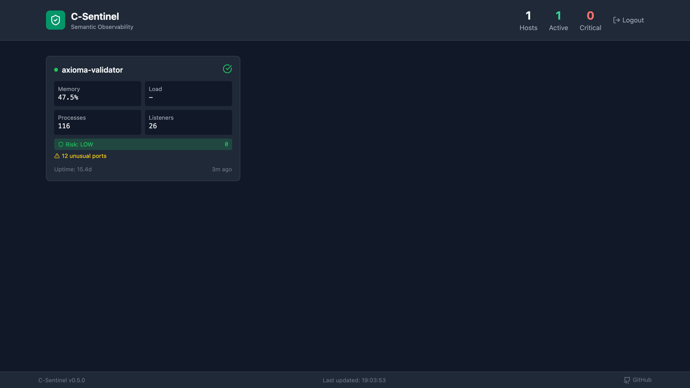
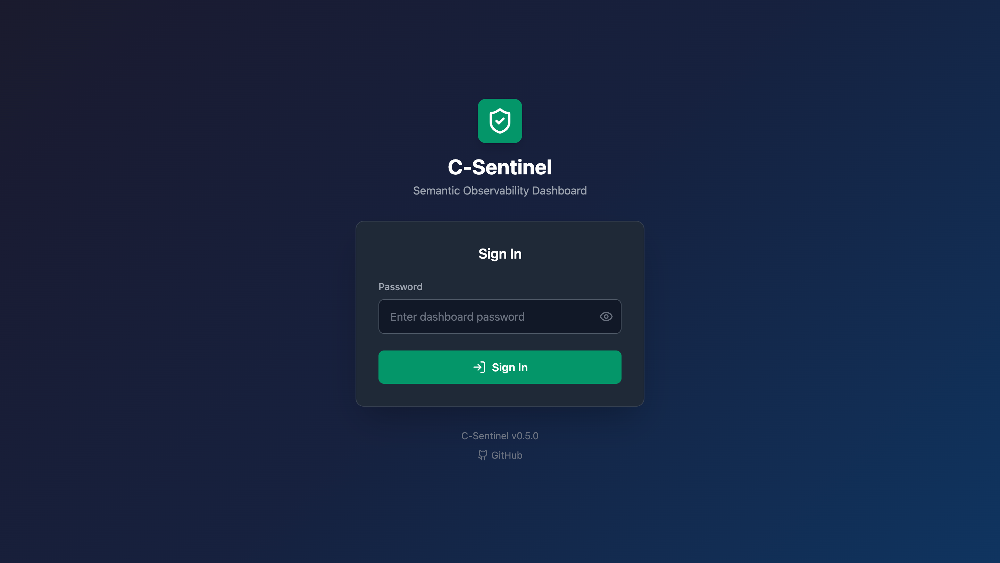

# C-Sentinel

**Semantic Observability for UNIX Systems**

A lightweight, portable system prober written in C that captures "system fingerprints" for AI-assisted analysis of non-obvious risks. Features auditd integration, explainable risk scoring, and a live web dashboard with enterprise-grade multi-user authentication.

[](https://opensource.org/licenses/MIT)


**Live Demo**: [sentinel.speytech.com](https://sentinel.speytech.com)

### Security Dashboard


### Multi-Host Overview


### Secure Login


## What's New in v0.6.0

- 👥 **Multi-User Authentication** - Role-based access control (Admin/Operator/Viewer)
- 🔐 **Two-Factor Authentication** - TOTP support with Google Authenticator, Authy, etc.
- 🔑 **Personal API Keys** - Per-user API keys for automation and CI/CD
- 📋 **Admin Audit Log** - Track all user actions with filtering
- 💻 **Session Management** - View active sessions, revoke access, force logout
- 📧 **User Email Notifications** - Login alerts, password changes, account events
- 🎨 **Modern Toast Notifications** - No more 1990s JavaScript alerts!
- 🌐 **Real Client IP Detection** - Proper X-Forwarded-For handling behind proxies

### Previous Releases

**v0.5.x**: Security posture summary, risk trend sparkline, learning indicator, explainable risk factors, email alerts, event history

**v0.4.0**: Auditd integration, brute force detection, privacy-preserving username hashing, process attribution, risk scoring

**v0.3.0**: Web Dashboard, SHA256 checksums, systemd service, baseline learning, network probe, watch mode

## The Problem

Modern observability tools like Dynatrace, Datadog, and Prometheus are excellent at metric collection and threshold alerting. But they answer a narrow question: *"Is this metric outside its expected range?"*

They struggle with:
- **Causal reasoning**: *Why* did something fail?
- **Context synthesis**: Connecting a config change last week to today's latency spike
- **Non-obvious degradation**: Things that aren't "broken" but are drifting toward failure
- **Security context**: Understanding *who* accessed *what* and *why it matters*

C-Sentinel takes a different approach: capture a comprehensive system fingerprint—including security events—and use LLM reasoning to identify the "ghosts in the machine."

## Quick Start

```bash
# Clone and build
git clone https://github.com/williamofai/c-sentinel.git
cd c-sentinel
make

# Quick analysis
./bin/sentinel --quick --network

# Quick analysis with security events (requires root for audit logs)
sudo ./bin/sentinel --quick --network --audit

# Learn baselines (automatic with --audit flag)
./bin/sentinel --learn --network

# Continuous monitoring with full context
sudo ./bin/sentinel --watch --interval 300 --network --audit
```

## Dashboard Features

The web dashboard provides real-time security monitoring across your infrastructure.

### Multi-User Authentication

Enterprise-grade access control with three roles:

| Role | Permissions |
|------|-------------|
| **Admin** | Full access: manage users, view audit logs, all operations |
| **Operator** | Acknowledge events, reset counters, view all data |
| **Viewer** | Read-only access to dashboards and data |

### Two-Factor Authentication (TOTP)

Secure your account with industry-standard TOTP:
- Works with Google Authenticator, Authy, Microsoft Authenticator
- QR code setup for easy configuration
- Required on every login when enabled
- Email notifications on enable/disable

### Personal API Keys

Each user can create their own API keys for automation:
- Named keys (e.g., "CI/CD Pipeline", "Monitoring Script")
- Optional expiration dates
- Enable/disable without deleting
- Last-used tracking
- Keys inherit user's role permissions

```bash
# Use your personal API key
curl -X POST https://sentinel.example.com/api/ingest \
  -H "Content-Type: application/json" \
  -H "X-API-Key: sk_your_personal_key" \
  -d @fingerprint.json
```

### Admin Audit Log

Track all user actions for compliance and security:
- Login/logout events with IP addresses
- User management actions (create, update, delete)
- Password changes
- Session revocations
- Filterable by user, action type, and time range

### Session Management

Full visibility into active sessions:
- See who's logged in and from where
- Device and browser detection
- Revoke individual sessions
- "Logout all others" for security incidents
- Automatic cleanup of expired sessions

### Security Posture Summary

Plain English explanation of your system's security status:

> "This system shows no security concerns. Authentication patterns are normal with no failures detected. No privilege escalation activity detected. Overall posture: **HEALTHY**."

### Explainable Risk Scoring

Every risk score includes factors that explain *why*:

| Factor | Weight |
|--------|--------|
| 10 authentication failures (200% above baseline - high) | +30 |
| Brute force attack pattern detected | +10 |
| 2 sensitive file(s) accessed | +4 |
| **Total** | **44** |

### Learning/Calibration Indicator

The system learns what's "normal" for your environment:

| Samples | Status | Meaning |
|---------|--------|---------|
| < 10 | 🧠 Learning | Building initial baseline |
| 10-50 | 🧠 Calibrating | Refining normal patterns |
| > 50 | *(hidden)* | Fully calibrated |

### Risk Trend Sparkline

A mini chart showing 24-hour risk score history - instantly see if things are getting better or worse.

### Email Alerts

Automatic notifications when:
- Risk score ≥ 16 (high/critical)
- Brute force attack detected
- Executions from /tmp or /dev/shm
- User login from new IP
- Password or 2FA changes

## Auditd Integration

C-Sentinel summarises auditd logs for semantic security analysis.

### Example Output

```
C-Sentinel Quick Analysis
========================
Hostname: axioma-validator
Uptime: 14.5 days
Load: 0.02 0.04 0.00
Memory: 49.2% used
Processes: 120 total

Potential Issues:
  Zombie processes: 0
  High FD processes: 1
  Long-running (>7d): 95
  Config permission issues: 0

Network:
  Listening ports: 26
  Established connections: 14
  Unusual ports: 12 ⚠

Security (audit):
  Auth failures: 6
  ⚠ BRUTE FORCE PATTERN DETECTED
  Sudo commands: 81
  Sensitive file access: 2
    - /etc/passwd by touch
    - /etc/shadow by touch ⚠

  Risk: high (score: 25)
```

### JSON Output

```json
{
  "audit_summary": {
    "enabled": true,
    "period_seconds": 300,
    "authentication": {
      "failures": 6,
      "failure_users_hashed": ["user_c4c5", "user_b91b"],
      "brute_force_detected": true
    },
    "privilege_escalation": {
      "sudo_count": 81,
      "sudo_baseline_avg": 12.5,
      "sudo_deviation_pct": 548.0,
      "su_count": 5
    },
    "file_integrity": {
      "sensitive_file_access": [
        {
          "path": "/etc/shadow",
          "access": "write",
          "count": 2,
          "process": "touch",
          "process_chain": ["touch", "bash", "sshd"],
          "suspicious": true
        }
      ]
    },
    "learning": {
      "sample_count": 42,
      "confidence": "medium"
    },
    "risk_factors": [
      {"reason": "6 auth failures (200% above baseline - high)", "weight": 18},
      {"reason": "Brute force attack pattern detected", "weight": 10}
    ],
    "risk_score": 25,
    "risk_level": "high"
  }
}
```

### Setup Audit Rules

For best results, add audit rules for sensitive files:

```bash
# Add audit rules
sudo auditctl -w /etc/passwd -p wa -k identity
sudo auditctl -w /etc/shadow -p wa -k identity
sudo auditctl -w /etc/sudoers -p wa -k priv_esc
sudo auditctl -w /var/log/lastlog -p wa -k auth

# Make permanent (add to /etc/audit/rules.d/sentinel.rules)
```

### Privacy Features

- **Username hashing**: Failed login usernames are hashed (e.g., `user_c4c5`) preserving pattern detection without exposing identities
- **No passwords**: Command arguments and sensitive data never captured
- **Process names only**: Full paths sanitised for privacy

## Web Dashboard

C-Sentinel includes a web dashboard for monitoring multiple hosts in real-time.

### Features

- **Multi-User Authentication** - Role-based access control
- **Two-Factor Authentication** - TOTP with QR code setup
- **Personal API Keys** - Per-user automation keys
- **Admin Audit Log** - Complete action history
- **Session Management** - Active session control
- **Security Posture Summary** - Plain English system status
- **Risk Trend Sparkline** - 24-hour visual history
- **Explainable Risk Factors** - Know *why* the score is what it is
- **Learning Indicator** - Baseline calibration progress
- **Event History** - Timeline with acknowledgement
- **Email Alerts** - Proactive notifications
- **Real-time Monitoring** - All hosts at a glance
- **Historical Charts** - Memory and load over 24 hours
- **Network View** - All listening ports and connections
- **Config Tracking** - SHA256 checksums of monitored files

### Quick Setup

```bash
# Install dashboard
cd dashboard
sudo ./install-dashboard.sh

# Run database migration (for multi-user features)
sudo -u postgres psql -d sentinel -f migrate_users.sql

# Install 2FA dependencies
sudo /opt/sentinel-dashboard/venv/bin/pip install pyotp qrcode pillow

# Configure agent to report (with audit)
*/5 * * * * sudo /usr/local/bin/sentinel --json --network --audit | curl -s -X POST \
  -H "Content-Type: application/json" \
  -H "X-API-Key: YOUR_KEY" \
  -d @- https://your-dashboard.com/api/ingest
```

### Email Alert Configuration

Add to your systemd service or environment:

```bash
ALERT_EMAIL_ENABLED=true
ALERT_SMTP_HOST=smtp.gmail.com
ALERT_SMTP_PORT=587
ALERT_SMTP_USER=your@email.com
ALERT_SMTP_PASS=your-app-password
ALERT_FROM=your@email.com
ALERT_TO=alerts@email.com
ALERT_COOLDOWN_MINS=60
```

See [dashboard/README.md](dashboard/README.md) for full setup instructions.

## Systemd Service

For production deployment:

```bash
# Install
sudo ./install.sh

# Enable and start
sudo systemctl enable sentinel
sudo systemctl start sentinel

# Check status
sudo journalctl -u sentinel -f
```

## All Features

| Feature | Command | Description |
|---------|---------|-------------|
| Quick analysis | `--quick` | Human-readable summary |
| Network probe | `--network` | Listening ports & connections |
| **Audit probe** | `--audit` | Security events (requires root) |
| Watch mode | `--watch --interval 60` | Continuous monitoring |
| Baseline learn | `--learn` | Save current state as "normal" |
| **Audit baseline** | `--audit-learn` | Learn normal security patterns |
| Baseline compare | `--baseline` | Detect deviations |
| JSON output | `--json` | Full fingerprint for LLM/dashboard |
| Config | `--config` | Show current settings |

### Exit Codes (for CI/CD)

| Code | Meaning |
|------|---------|
| 0 | No issues detected |
| 1 | Warnings (minor issues) |
| 2 | Critical (zombies, permission issues, unusual ports, **high-risk security events**) |
| 3 | Error (probe failed) |

## What It Captures

| Category | Data | Purpose |
|----------|------|---------|
| System | Hostname, kernel, uptime, load, memory | Basic health context |
| Processes | Notable processes with metadata | Zombie, leak, stuck detection |
| Configs | File metadata + SHA256 checksums | Cryptographic drift detection |
| Network | Listeners, connections, ports | Service monitoring |
| **Security** | Auth failures, sudo usage, file access | Threat detection |

## What It Flags

### System Issues
- 🧟 **Zombie processes**: Always a problem
- 📂 **High FD counts**: Potential descriptor leaks (>100 open)
- ⏰ **Long-running processes**: >7 days without restart
- 🔓 **Permission issues**: World-writable configs

### Network Issues
- 🌐 **Unusual ports**: Services not in common ports list
- 📡 **New listeners**: Ports that weren't in baseline
- ❌ **Missing services**: Expected ports that stopped listening

### Security Issues (with --audit)
- 🔐 **Brute force**: Auth failure spikes (>5 in window)
- 📊 **Baseline deviation**: Activity significantly above normal
- 📝 **Sensitive file access**: /etc/shadow, /etc/sudoers modifications
- ⚠️ **Suspicious processes**: Unusual process accessing sensitive files
- 💀 **Malware indicators**: Executions from /tmp or /dev/shm

## Architecture

```
┌─────────────────────────────────────────────────────────────────┐
│                      Web Dashboard                              │
│  • Multi-user auth (RBAC)      • Two-factor authentication      │
│  • Personal API keys           • Session management             │
│  • Admin audit log             • Email notifications            │
│  • Security posture summary    • Risk trend sparkline           │
│  • Explainable risk factors    • Event history timeline         │
│  • Multi-host view             • Historical charts              │
└─────────────────────────────────────────────────────────────────┘
                              ▲
                              │ JSON via HTTP POST
                              │
┌─────────────────────────────────────────────────────────────────┐
│                     C Foundation (99KB)                         │
│  • /proc parsing              • SHA256 checksums                │
│  • Process analysis           • Drift detection                 │
│  • Network probing            • Baseline learning               │
│  • Auditd parsing             • Risk scoring                    │
│  • Process chains             • Anomaly detection               │
└─────────────────────────────────────────────────────────────────┘
```

### Why C?

| Concern | Python | C |
|---------|--------|---|
| **Dependencies** | Requires Python runtime (~100MB) | Static binary (~99KB) |
| **Startup time** | ~500ms interpreter startup | ~1ms |
| **Memory** | ~30MB baseline | <2MB |
| **Portability** | Needs matching Python version | Runs on any POSIX system |

## Building

```bash
make              # Release build
make DEBUG=1      # Debug build with symbols
make test         # Run basic tests
make install      # Install to /usr/local/bin
```

### Requirements
- GCC or Clang with C99 support
- GNU Make
- Linux (uses `/proc` filesystem)
- auditd (optional, for `--audit` flag)

## Project Structure

```
c-sentinel/
├── include/
│   ├── sentinel.h        # Core data structures
│   └── audit.h           # Audit integration types
├── src/
│   ├── main.c            # CLI entry point
│   ├── prober.c          # System probing (/proc)
│   ├── net_probe.c       # Network probing
│   ├── audit.c           # Auditd log parsing
│   ├── audit_json.c      # Audit JSON serialisation
│   ├── process_chain.c   # Process ancestry walking
│   ├── baseline.c        # Baseline learning
│   ├── sha256.c          # Pure C SHA256
│   └── ...
├── dashboard/            # Flask web dashboard
├── deploy/               # Systemd service files
└── docs/
    ├── AUDIT_SPEC.md     # Audit integration design
    └── DESIGN_DECISIONS.md
```

## Roadmap

### Completed ✅
- [x] Core system prober
- [x] JSON serialization  
- [x] Network probing
- [x] Watch mode & baseline learning
- [x] SHA256 checksums
- [x] Systemd service
- [x] Web dashboard
- [x] Auditd integration
- [x] Risk scoring with deviation analysis
- [x] Process attribution
- [x] Dashboard authentication
- [x] Event history timeline
- [x] Explainable risk factors
- [x] Security posture summary
- [x] Risk trend sparkline
- [x] Learning/calibration indicator
- [x] Email alerts
- [x] **Multi-user dashboard with roles**
- [x] **Two-factor authentication (TOTP)**
- [x] **Personal API keys**
- [x] **Admin audit log**
- [x] **Session management**

### Planned 📋
- [ ] FreeBSD/macOS support
- [ ] Slack/Teams webhook alerts
- [ ] Custom alert rules
- [ ] PDF security reports
- [ ] Host-level permissions

## License

MIT License - see [LICENSE](LICENSE) for details.

## Author

**William Murray** - 30 years UNIX systems engineering

- GitHub: [@williamofai](https://github.com/williamofai)
- LinkedIn: [William Murray](https://www.linkedin.com/in/william-murray-5180aa32b/)
- Website: [speytech.com](https://speytech.com)

---

*"The goal isn't to replace monitoring tools—it's to add wisdom to their data."*
